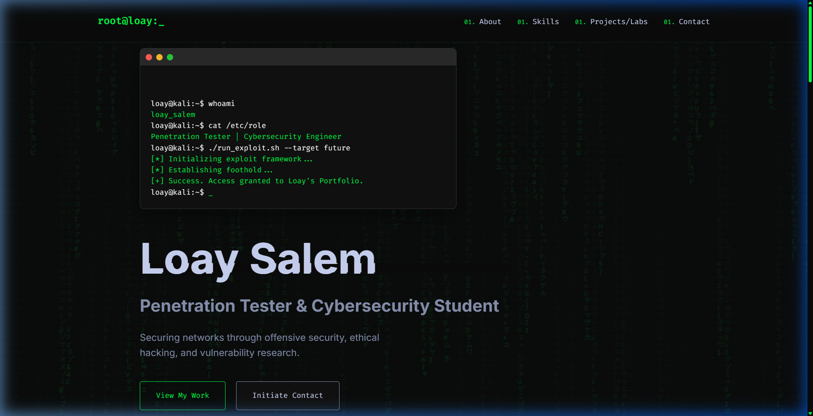
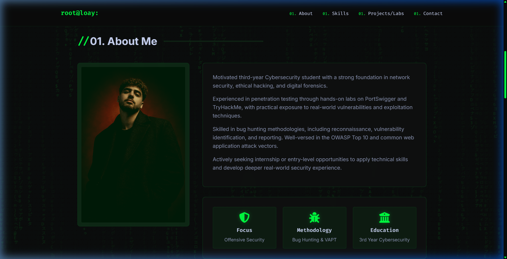
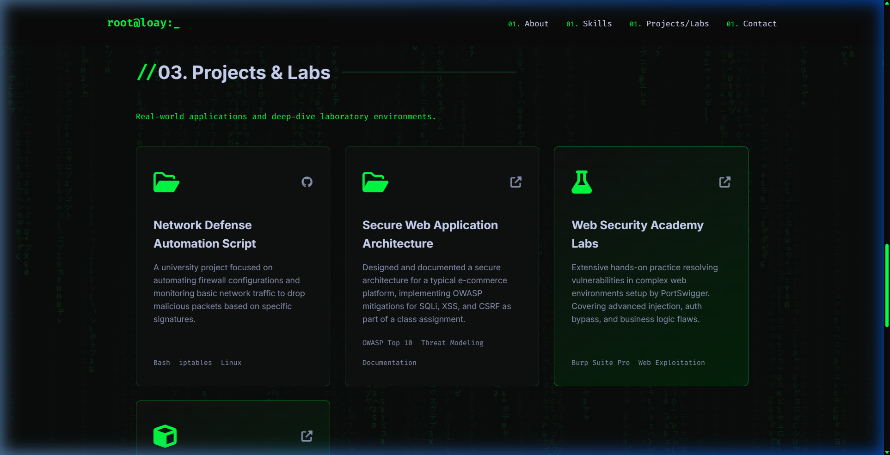

# 🔒 Loay Salem - Penetration Tester Portfolio

A custom-built, highly dynamic, and responsive portfolio website designed for a Cybersecurity Student & Penetration Tester. The design features a premium "Hacker/Neon" aesthetic, complete with terminal typing effects, a matrix code rain background, and sleek glassmorphism panels.

## 📸 Previews

### 1. Terminal Hero Section
Features a simulated terminal login sequence before revealing the portfolio title.

### 2. About & Stats Section
Showcases professional background, offensive security focus, and a stylized profile photo.

### 3. Projects & Labs
Highlights university security projects alongside hands-on practical experience from platforms like PortSwigger and TryHackMe.

## 🛠️ Technology Stack
This portfolio was built purely with native web technologies for maximum performance and zero dependencies.
- **HTML5:** Semantic structure and accessibility.
- **CSS3:** Custom variables, glassmorphism UI, CSS Grid/Flexbox, and keyframe animations for glitch effects.
- **Vanilla JavaScript:** Powers the HTML5 Canvas matrix background algorithm, intersection observer scroll reveals, and the dynamic typing simulation.

## 🚀 Deployment
This project is completely static and can be hosted for free on any platform:
1. **GitHub Pages (Recommended):** Just push this code to a public repository and enable Pages in the settings.
2. **Netlify / Vercel:** Drag and drop the folder into their dashboard.

## 👨‍💻 Author
**Loay Salem**
- Role: Penetration Tester & Cybersecurity Student
- Contact: loayhany327@gmail.com
- Profile: [TryHackMe](https://tryhackme.com/p/mandour948) | [PortSwigger](https://portswigger.net/users/youraccount/personaldetails)
